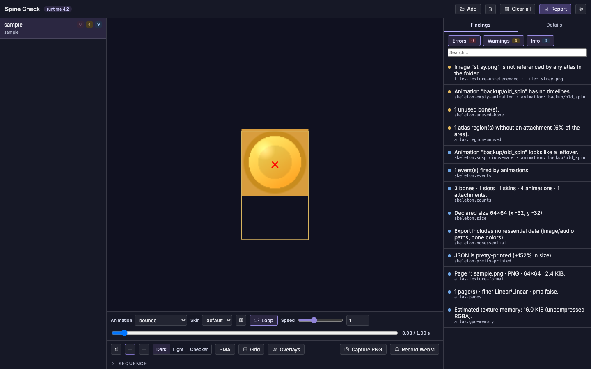

<p align="center">
  
</p>

<h1 align="center">Spine Check</h1>

<p align="center">
  Validate <a href="https://esotericsoftware.com/">Spine</a> deliveries in the browser: static checks, a real
  <code>spine-pixi-v8</code> preview and a report you can hand back to the art team.<br />
  <a href="https://spine-check.vercel.app"><strong>spine-check.vercel.app</strong></a> · nothing leaves your computer.
</p>

<p align="center">
  <a href="https://spine-check.vercel.app"></a>
  <a href="LICENSE"></a>
  
  
</p>

## Why

Art teams export Spine skeletons; games load them with the Spine runtime. Between the two, a lot can go
wrong silently: an attachment pointing at a region that is not in the atlas, a `@0.5x` variant exported
at 0.4, a texture whose name differs only by letter case, a `loop` animation that pops on every cycle,
20 MB of atlas pages on mobile. Spine Check reads the delivery exactly as the runtime does, tells you
what is wrong before it hits a build, and shows the animations running so you can sanity-check them.

## Features

- **Drop the delivery as it is** — a folder (recursively) or loose files: `.json` / `.skel`, `.atlas`,
  `.png` / `.webp` / `.jpg`. Files are grouped by base name; images are resolved from the atlas page
  names. Subfolders named `@0.5x`, `@2x`… become resolution variants of the parent bundle.
- **Static checks** on the JSON and the atlas — see the catalogue below.
- **Runtime checks** — the bundle is loaded through the real `spine-pixi-v8` API; load errors are reported
  with the runtime's exact message. Every animation is then probed offscreen: duration, events, bounds,
  NaN transforms and whether the pose at the end matches the pose at the start (seamless loop).
- **Preview** — animation, skin, loop, speed, scrub, root / `@0.5x` variant, dark / light / checker
  background, premultiplied-alpha toggle, grid, overlays (bones, regions, mesh, bounding boxes, paths,
  clipping, declared size, animation bounds), clip sequences with mix (intro → loop → outro), PNG capture
  and WebM recording.
- **Report** — Markdown or JSON for all loaded bundles, with a hint per finding. Copy or download.
- **Thresholds** — page size, texture memory, mesh size, suspicious name patterns, target runtime
  version… editable in Settings and kept in `localStorage`.
- **Keyboard** — Space play/pause · F fit · ← → step 1/30 s · L loop · B bones.
- **Responsive** — works on a phone for a quick check of a delivery.

## What it checks

Every finding has a stable code, a severity (error / warning / info), a message and a hint.

| Group | Examples |
|---|---|
| Files | missing atlas or skeleton, page image missing or with different letter case, unreferenced textures, `.json` + `.skel` together, unsafe file names |
| Skeleton | Spine version vs target runtime, attachment referencing a region that is not in the atlas (the runtime throws), empty animations, leftover names (`backup/`, `old`, `tmp`…), unused bones / slots / skins, events never fired, clipping, heavy meshes, deform timelines, constraints, blend modes, nonessential data, pretty-printed JSON |
| Atlas | declared `size` vs real image size, regions out of the page, oversized pages, duplicate or unused regions, low occupancy, texture format and size, estimated GPU memory |
| Variants | variant skeleton differs from the root, `scale` missing or different from the folder name, unexpected page sizes, missing images |
| Runtime | load failure with the exact runtime message, NaN in bone transforms, seamless loop and bounds per animation, events fired |

Target runtime: `@esotericsoftware/spine-pixi-v8` 4.2 (Spine 4.2 exports). Other major.minor versions
are reported as a version mismatch.

## Run locally

```bash
npm install
npm run dev        # http://localhost:5173
npm test           # Vitest (core + pure runtime)
npm run typecheck
npm run build      # production build in dist/
```

## Project layout

- `src/core/` — parsers, bundle grouping, checks and report. Pure TypeScript, unit-tested.
- `src/runtime/` — manual loading through spine-core, offscreen animation probe, PixiJS preview.
- `src/state/` — analysis pipeline and app state.
- `src/ui/` — React components. All copy lives in `src/ui/strings.ts`.

## Privacy

Everything runs in the browser. No upload, no analytics, no server. Settings are the only thing stored
(in `localStorage`).

## License

[MIT](LICENSE) © Ian Felix.

Spine is a trademark of Esoteric Software. The Spine Runtimes are licensed separately: using them in a
product requires a Spine Editor license — see the
[Spine Runtimes License](https://esotericsoftware.com/spine-runtimes-license).
